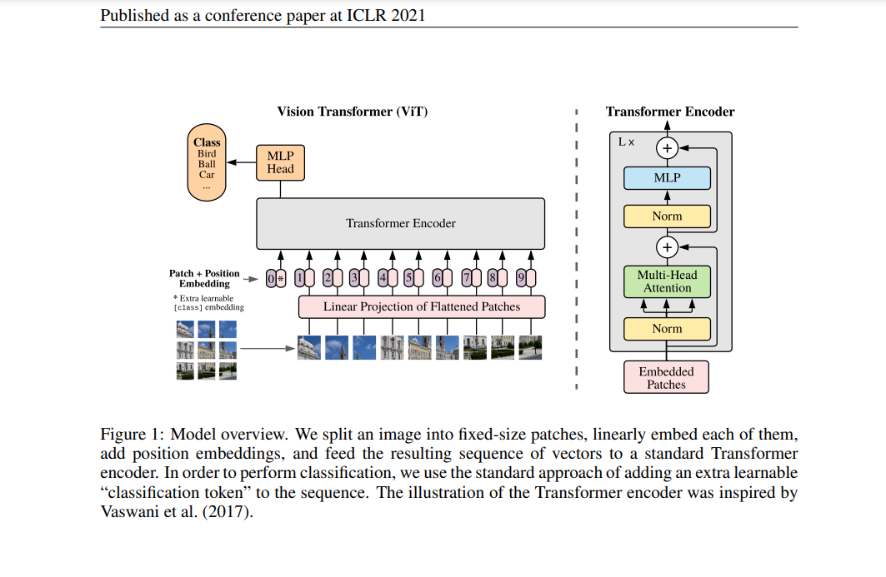

### **Vision Transformer (ViT)** 
   - Paper: [An Image is Worth 16x16 Words: Transformers for Image Recognition at Scale](https://arxiv.org/abs/2010.11929)

## Architecture

The Vision Transformer works by:
1. **Patch Embedding**: Dividing the input image into fixed-size patches (e.g., 16x16)
2. **Linear Projection**: Flattening and linearly projecting each patch to create token embeddings
3. **Position Embedding**: Adding positional embeddings to retain spatial information
4. **Transformer Encoder**: Processing the sequence of tokens through multiple transformer blocks
5. **Classification**: Using the [CLS] token output for image classification



### Key Components

- **Multi-Head Self-Attention (MSA)**: Allows the model to attend to different parts of the image simultaneously
- **MLP Block**: Non-linear transformations applied after attention
- **Layer Normalization**: Normalizes the features to stabilize training
- **Residual Connections**: Help in training deeper networks by providing gradient shortcuts

## Examples

```python
# Import the ViT model
from models.vit import ViT

# Create a ViT model
model = ViT(
    img_size=224,
    patch_size=16,
    in_channels=3,
    num_classes=1000,
    embedding_dim=768,
    depth=12,
    num_heads=12
)

# Forward pass
import torch
img = torch.randn(1, 3, 224, 224)
output = model(img)  # Shape: [1, 1000]
```


